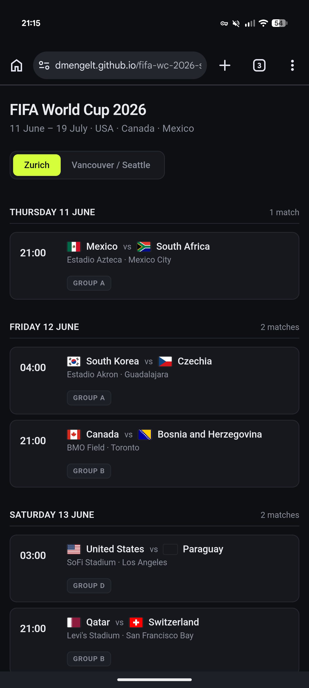

# FIFA World Cup 2026 — Schedule

A single-page schedule for the 2026 FIFA World Cup (11 June – 19 July, USA · Canada · Mexico). Kick-off times are shown in either Zurich or Vancouver / Seattle, with day-by-day grouping, country flags, and stage badges for knockout rounds.

  

